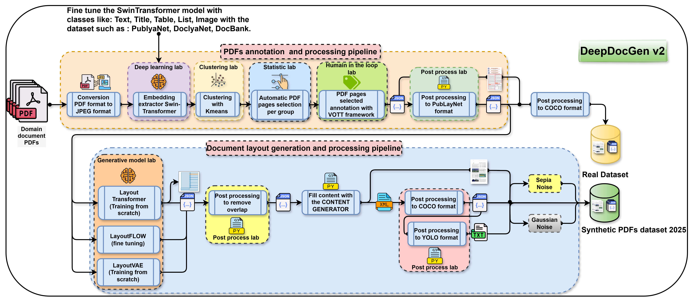

# 🌟 Welcome to **DeepDoc Generator World** 🌟  

<p align="center">
  <a href="https://github.com/Geo99pro/DeepDocGen">[CODE]</a><br>
</p>

This repository hosts all the code used to build our cutting-edge synthetic document pipeline. Dive into the world of synthetic document generation and object detection powered by deep learning!  

## 📝 **Paper Title**  
**Generation and Detection of Objects in Documents by Deep Learning Neural Network Models (DeepDocGen)**  
📢 *Our paper is coming soon! Stay tuned for the official release.*  


## 📖 **About the Project**  
**DeepDocGen** is a pipeline designed to overcome the challenges of limited annotated datasets in document analysis. By generating synthetic documents, DeepDocGen empowers researchers and developers to train and fine-tune object detection models with high accuracy and robustness.  


## 🛠️ **Technologies Used**  

**DeepDocGen** integrates state-of-the-art layout generation models to enhance synthetic document creation. These include:  

- **[LayoutTransformer](https://github.com/kampta/DeepLayout)**: Layout Generation and Completion with Self-attention.  
- **[LayoutFlow](https://github.com/JulianGuerreiro/LayoutFlow)**: Flow Matching for Layout Generation.
- **[LayoutVAE](https://github.com/Layout-Generation/layout-generation/tree/master/LayoutVAE)** : *coming soon!*

📢 *More models coming soon!*


## 🎨 **Visual Overview**  

### 🛠️ **DeepDocGen Workflow**  
<p align="center">
  
</p>  


### 📊🎥 **Some Document Sample Created**
        
  <p align="center">
    
  </p>  

---

## 💡 **How to Get Started**  
1. Clone this repository:  
   ```bash
   git clone https://github.com/Geo99pro/DeepDocGen.git
   ```